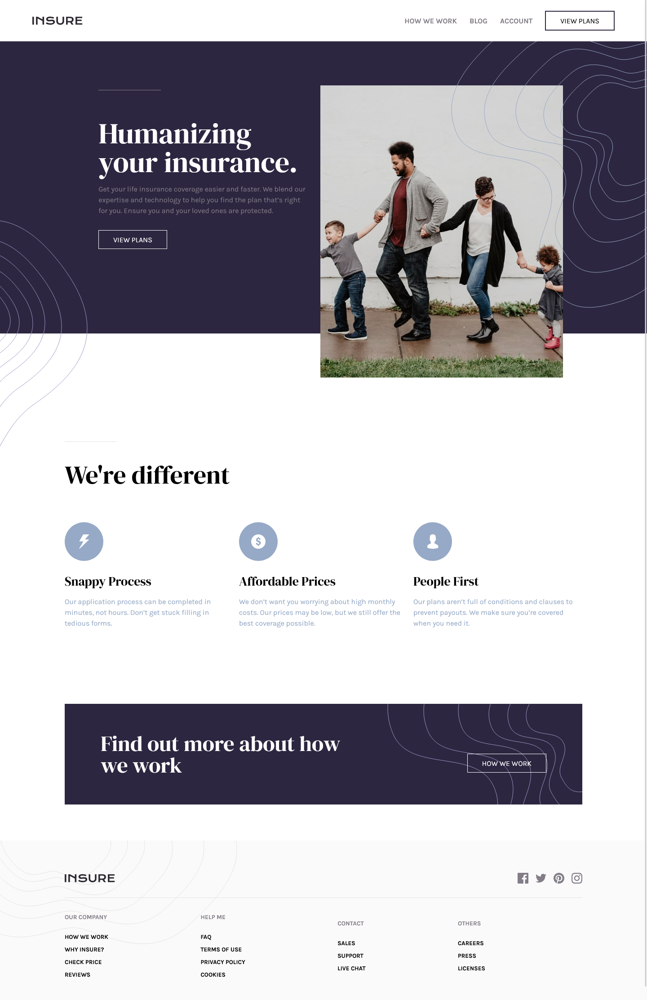

## Table of contents

- [Overview](#overview)
  - [The challenge](#the-challenge)
  - [Screenshot](#screenshot)
  - [Links](#links)
  - [Built with](#built-with)
  - [Useful resources](#useful-resources)
- [Author](#author)

### The challenge

Users should be able to:

- View the optimal layout for the site depending on their device's screen size
- See hover states for all interactive elements on the page

### Screenshot

### Links

- Solution URL: [Add solution URL here](https://github.com/MikDra1/insure-landing-page)
- Live Site URL: [Add live site URL here](https://insurelandingpage1.netlify.app)

### Built with

- Semantic HTML5 markup
- CSS Modules
- Flexbox
- CSS Grid
- Mobile-first workflow
- [React](https://reactjs.org/) - JS library
- [Vite](https://vitejs.dev/)

### Useful resources

- [Medium](https://medium.com/@josephat94/building-a-simple-react-hook-to-detect-screen-size-404a867fa2d2) - This helped me with state change on screen width change.

**Note: Delete this note and replace the list above with resources that helped you during the challenge. These could come in handy for anyone viewing your solution or for yourself when you look back on this project in the future.**

## Author

- Frontend Mentor - [@MikDra1](https://www.frontendmentor.io/profile/MikDra1)
